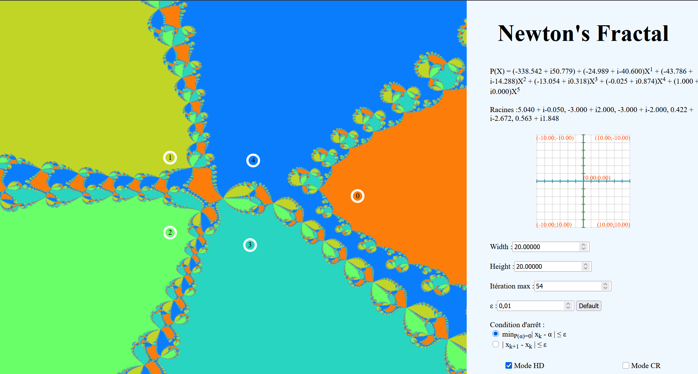

# NewtonFractalsDrawer
Ce programme a pour but de dessiner la factale de Newton associé à un polynôme P de C[X] de façon dynamique.
Le but est de pouvoir observer l'évolution de la Fractale de Newton dynamiquement en fonction du polynôme, ce
qui se traduit ici par la possibilité de modifier les racines en Drag'n'Drop, et d'avoir l'actualisation de
la fractale en temp réel.
Le fichier index.html permet d'accéder à l'application.

L'écran est une partie du plan complexe, sur lequel aparraissent les n racines qui définissent le polynôme.
Chaque point du complexe est colorié selon la racine vers laquelle converge les itérations de la Méthode de
Newton débutant à ce point.
Dans le cas de non convergence de la méthode, le point sera colorié en noir.

# Utilisation

- L'exploration du plan se fait par Drag'n'Drop sur l'image elle-même.

- Les touches UP et Down permettent de modifier le nombre de racine, dans un maximum de 30, qui apparaisseront
au centre de l'écran par défaut.

- La molette de la souris permet de zoomer sur une zone centrée sur le pointeur de la souris.

- La touche ENTRER permet de réinitialiser la fractale à son état par défaut et la touche ESPACE d'avoir une
démonstration pour un polynôme de degré 7.

- La touche ECHAP permet de recharger l'écran.

- Les informations sur le polynôme, la partie du plan complexe observée et les paramètres de la méthode de
Newton sont affichées à droites, avec la possibilité d'en modifier certaines, telle que le critère d'arrêt.

- Le mode HD (Haute Définition) permet d'avoir une image plus précise pour les actions autres que le 
Drag'n'Drop, au prix d'un léger temps de chargement.

- Le mode CR (Convergence Rate) ajouter un dégradé aux couleurs en fonction de la vitesse de convergence de la
méthode de Newton pour chaque point
